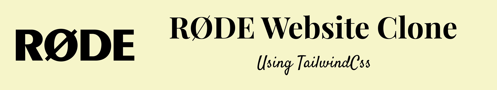

# RØDE-WEBSITE-CLONE

## About

This is Rode website clone project. This looks like simple website but it is complicated it uses diffferent image for mobile and desktop. I have created this full website using TailwindCss and html.

## ⚙️ What did I learn by making this project?

-   learn using background images in tailwindcss.
-   learn using different images in different breakpoints.

## ⌛ Time taken to finish this project?

This project took me around 10 hour to finish. It tooks more time to figure out how to do background image.

## 📷 Screenshots

